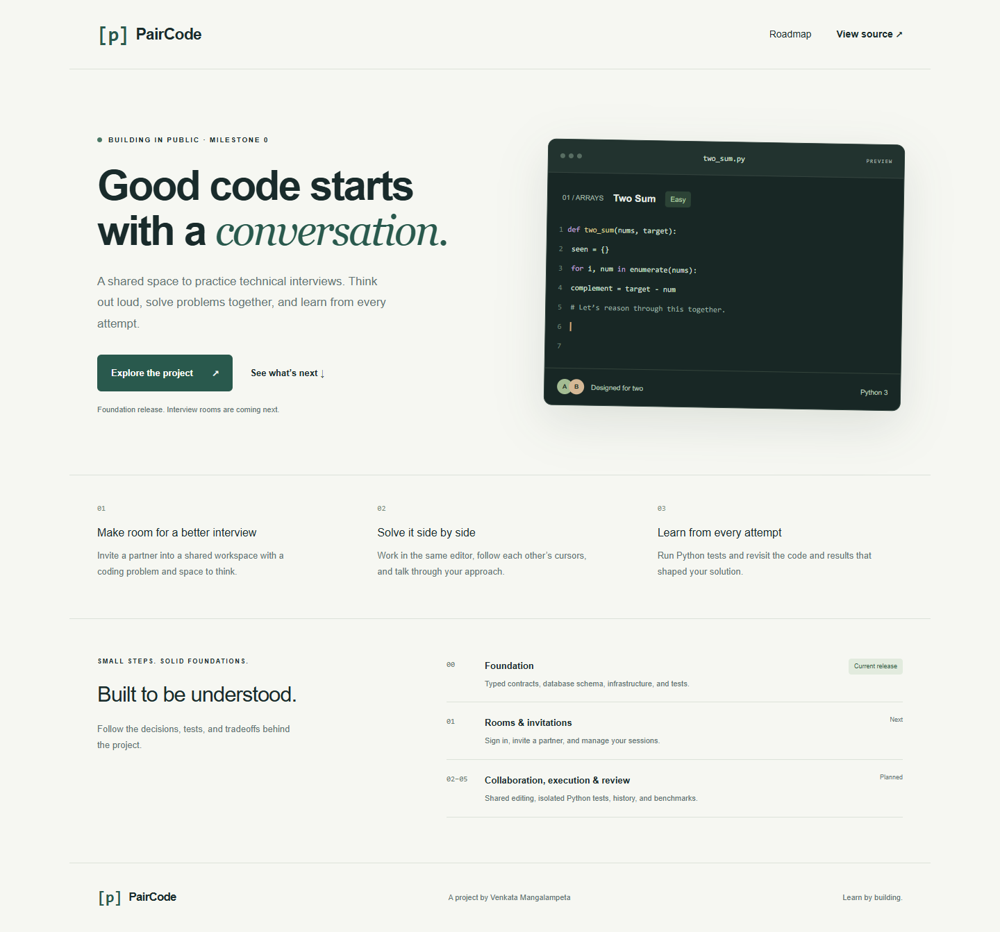

# PairCode

**Practice technical interviews together. Understand every decision.**

PairCode is a collaborative coding interview practice platform being built in public. The planned experience combines a shared Monaco editor, cursor presence, isolated Python test execution, and a reviewable session history.

> **Current work: Milestone 2 — shared editing.** Rooms, authenticated Yjs connections, Monaco editing, remote cursors, reconnects, and saved document state are implemented. Two-browser editor tests pass. Live Clerk sign-in still needs configuration and a two-account verification. Python execution is next. The editor on the landing page is a labeled illustration.



## Why this project

The project explores three concrete engineering problems:

- Keeping two editors consistent through concurrent edits and reconnects.
- Executing untrusted programs outside the web application.
- Recovering work when PostgreSQL, a queue, and an execution service disagree about progress.

The first useful demo is deliberately small: invite one partner, solve one problem, and come back to the attempts afterward. Getting reconnects and failed runs right matters more here than adding another feature to the landing page.

The [build notes](docs/build-notes.md) cover fixes from testing and decisions still worth revisiting. Performance numbers will come from measured runs.

## Stack

Next.js App Router · TypeScript strict mode · Tailwind CSS · PostgreSQL · Prisma · Redis/BullMQ · Yjs/Monaco · Clerk · isolated Judge0 API · Vitest · Playwright.

Dependencies for later milestones are pinned, but installation does not mean those features are implemented. See [the roadmap](docs/roadmap.md).

## Quick start: foundation preview

Requirements: **Node 24** and **pnpm 11.19.0**. Docker is not required for the landing page or the local PostgreSQL WASM constraint tests.

```bash
git clone https://github.com/v4nkat/paircode.git
cd paircode
npm install --global pnpm@11.19.0
pnpm install --frozen-lockfile
pnpm db:generate
pnpm dev
```

Open **http://localhost:3000**. The foundation page requires no authentication credentials and never executes submitted code.

For shared editing, see [collaboration setup and verification](docs/collaboration.md). To use rooms, follow [the sign-in and database setup guide](docs/auth-setup.md). Next.js needs its own `apps/web/.env.local`; the root `.env` is used by migration and Compose commands. Open the app at the exact configured `APP_ORIGIN` when creating or joining rooms.

## Start the development services

Install Docker Desktop with Linux containers. Copy `.env.example` to `.env`, set a random **local-only** `POSTGRES_PASSWORD`, and put the same URL-encoded password in `DATABASE_URL`. Set a generated `COLLABORATION_CONTROL_SECRET` as described in the collaboration guide. The checked-in values are placeholders, not usable production credentials.

```bash
docker compose --env-file .env -f infra/compose.yaml config
docker compose --env-file .env -f infra/compose.yaml up -d postgres redis
pnpm env:check
pnpm db:migrate
pnpm db:seed
```

Ports are bound to loopback. PostgreSQL and Redis use named volumes. The collaboration health endpoint is **http://localhost:1234/healthz**. It reports relay readiness. WebSocket upgrades require a short-lived ticket from the authenticated room API.

The execution worker remains unavailable until Milestone 3. It does not consume or run untrusted jobs. Do not expose this development Compose stack publicly.

Stop services without deleting data:

```bash
docker compose --env-file .env -f infra/compose.yaml down
```

## Checks

```bash
pnpm check
pnpm build
pnpm exec playwright install chromium
pnpm test:e2e
```

`pnpm check` runs formatting, lint, strict type checking, unit tests, SQL constraint tests, and a static Compose exposure check. `pnpm test:integration` uses PGlite (PostgreSQL compiled to WASM) if no test database is configured. GitHub Actions supplies `TEST_DATABASE_URL` to run those same migration/constraint tests against a PostgreSQL service in an isolated schema.

Never point `TEST_DATABASE_URL` at a production database. The test creates and removes its own randomly named schema.

See [the collaboration report](docs/collaboration.md) for what transport, persistence, and browser tests establish and what still needs live service verification. `pnpm test:performance` currently exits with an explanation rather than printing invented benchmark results.

## Repository map

| Path                       | Responsibility                                                               |
| -------------------------- | ---------------------------------------------------------------------------- |
| `apps/web`                 | Next.js application and landing page                                         |
| `apps/collaboration`       | Authenticated Yjs relay, presence validation, and debounced persistence      |
| `apps/worker`              | Reserved execution worker entry point; implementation follows in Milestone 3 |
| `packages/contracts`       | Validated public input shapes and safe result projections                    |
| `packages/config`          | Validated per-process environment contracts and application limits           |
| `packages/database`        | Prisma schema, reviewed SQL migration, database adapter, versioned seed      |
| `packages/problem-catalog` | Server-side problem definitions and test fixtures                            |
| `packages/queue`           | Execution job contract and bounded retry policy                              |
| `tests`                    | Unit, SQL integration, WebSocket, and browser tests                          |
| `infra`                    | Local Compose and collaboration container                                    |

## Read the engineering decisions

- [Architecture and request flow](docs/architecture.md)
- [Database guarantees](docs/database.md)
- [API plan](docs/api.md)
- [Environment variables](docs/environment.md)
- [Security and known limits](SECURITY.md)
- [Performance measurement plan](docs/performance.md)
- [Milestone roadmap](docs/roadmap.md)
- [Interview explanations](docs/interview-explanation.md)
- [Verification report](docs/verification.md)
- [Build notes and open decisions](docs/build-notes.md)

## Troubleshooting

- **Missing Prisma client:** run `pnpm db:generate` after installation or schema edits.
- **Cannot connect to PostgreSQL:** check Compose health and the password/host in `.env`. From the host use `127.0.0.1`; services inside Compose use the service hostname.
- **Existing database rejects a changed password:** changing an environment variable does not change a PostgreSQL user's password in an existing volume. Use the original local credentials or intentionally create a new disposable development database.
- **Port already in use:** change the Compose host port and corresponding local URL together.
- **No Clerk or sandbox credentials:** the foundation preview still works. Later milestones must remain unavailable until their dependencies are configured.
- **Playwright browser missing:** run `pnpm exec playwright install chromium`.
- **Windows:** use PowerShell, Node 24, and Docker Desktop's Linux-container mode. Sandbox hosting requires a separately verified Linux environment.

## Sharing responsibly

Link this repository as a work in progress. Describe completed milestones accurately. The final two-person demo and resume measurements will be added only after they work and are verified.
