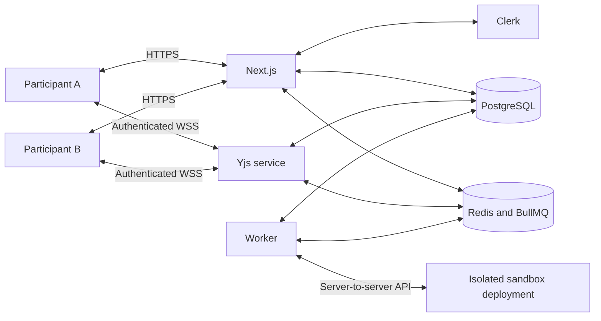
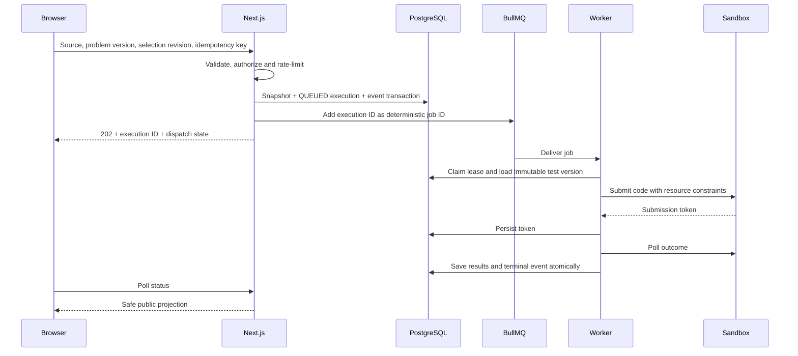

# Architecture

## Boundaries

This is the approved target architecture. Milestone 0 implements the repository/database foundation and a web landing page. It does not yet implement the arrows as live feature integrations.

## Collaboration

One Yjs document belongs to a room. Store a named text draft for each predefined problem, with only one selected problem visible. Selection is authorized server state with a monotonically increasing revision. A stale run request is rejected instead of pairing code with the wrong test suite.

Use stable Yjs 13, y-websocket, and y-monaco. Their versions are pinned in the lockfile. The current upstream WebSocket server exports programmatic persistence hooks; the installed API must be inspected when implementing Milestone 2. Do not copy deprecated `YPERSISTENCE` setup from an older tutorial.

Load serialized Yjs state before synchronization. Initialize starter code once on the server. Reconnect merges updates instead of replacing the current text with a browser's old plain-text snapshot. Presence is ephemeral and never authorizes access. Participant names/colors must be associated with authenticated membership.

Persist snapshots after one second of inactivity and at least every five seconds while editing, with serialized writes per room. A successful database acknowledgement is required before displaying Saved. A hard crash can lose changes after the last flush if no surviving client can resynchronize them. Flush before an acknowledged room end.

Only one collaboration instance owns room documents in the MVP. Horizontal scaling requires explicit ownership/routing or a compatible shared backend, not simply starting another replica.

## Run Tests

The source snapshot is the submitting user's current editor content. Edits continue while it executes. Runs do not claim to represent a globally instantaneous view of all clients.

PostgreSQL and Redis are not one transaction. A pending dispatch record in Execution and a recovery loop repair interrupted enqueues. Deterministic job IDs, expiring worker leases, and unique per-test results prevent duplicate application effects. They do not prove exactly-once sandbox computation: an accepted submission whose HTTP response was lost may execute twice. Reuse known sandbox tokens, bound retries, and document ambiguity.

Normal lifecycle: QUEUED -> RUNNING -> PASSED / FAILED / ERROR. Deterministic incorrect code completes as FAILED. Only infrastructure failures use bounded exponential retries. Terminal rows are not silently reopened.

## Sources

- [Yjs WebSocket server](https://github.com/yjs/y-websocket-server)
- [Yjs Monaco binding](https://github.com/yjs/y-monaco)
- [BullMQ idempotent jobs](https://docs.bullmq.io/patterns/idempotent-jobs)
- [BullMQ retry guidance](https://docs.bullmq.io/guide/retrying-failing-jobs)
- [Clerk route handlers](https://clerk.com/docs/reference/nextjs/app-router/route-handlers)
- [Judge0 API](https://ce.judge0.com/)
